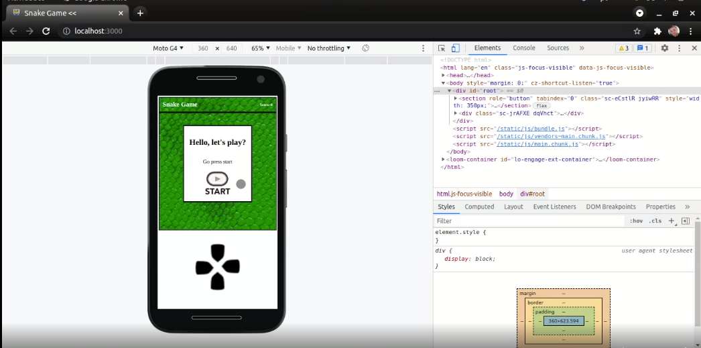
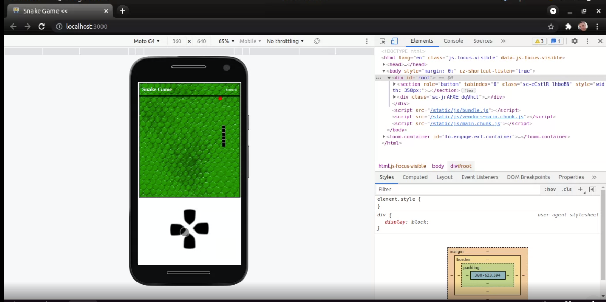
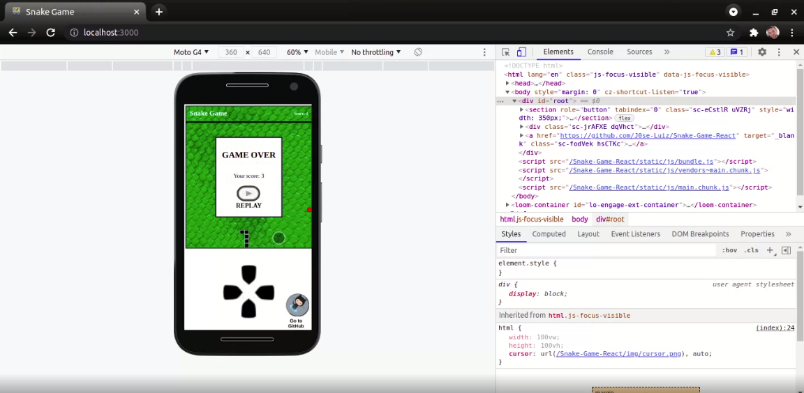
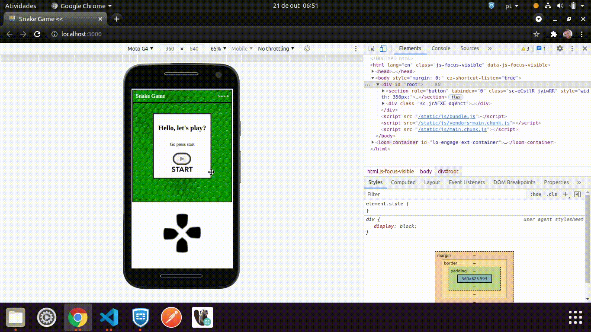
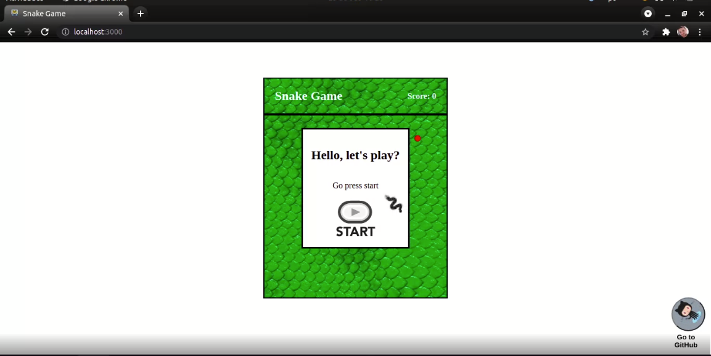
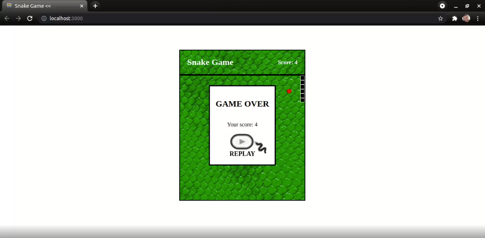

<h1 align="center"> Snake Game React :video_game: :snake:</h1><br/>

<!-- <p align="center"><a href="https://github.com/J0se-Luiz/site-react-on-git.git" target="_blank">Play this one by clicking here or follow the instructions to download!</a></p> -->

##  [:video_game: :video_game: Go Go Go CLICK-ME :video_game: :video_game: **Snake Game** Play this one by clicking here or follow the instructions to download!](https://j0se-luiz.github.io/Snake-Game-React/)


<br/>

### **Snake Game**  (Snake, also known as "snake game") is a game that was known for several versions whose initial version began with the 1976 game Blockade, with several imitations being made in video games and computers. [but on the subject](https://pt.wikipedia.org/wiki/Serpente_(jogo_eletr%C3%B4nico))
---
<br>


<p align="center">Lets go to what matters ...</p>
<br/>

## **Instructions and controls** 

<br/>

<P align="center"><strong> MOBILE </strong></P>
<p align="center"> Use the <strong> buttons on the mobile controller</strong> to indicate the direction you should go.</p> <br>

<section align="center">




<!-- <video controls="true" width="100%" width="320" height="240" align="center" allowfullscreen="true" poster="./contentForReadme/print/videoCover.png">
<source src="./contentForReadme/video/mp4/snake-game-react-mobile.mp4" type="video/mp4"></source>
<source src="./contentForReadme/video/ogv/snake-game-react-mobile.ogv" type="video/ogv"></source>
<source src="./contentForReadme/video/webm/snake-game-react-mobile.webm" type="video/webm"></source>
</video> -->



<section>

<br/>

<P align="center"><strong> DESKTOP </strong></P>
<p align="center"> use the keys <strong>W, A, S, D</strong> or the arrow keys <strong>TOP, LEFT, RIGHT, DOWN</strong> to indicate game directions.</p> <br>

<section align="center">





<!-- <video controls="true" width="100%" width="320" height="240" align="center" allowfullscreen="true"  poster="./contentForReadme/print/videoCover.png" >
<source src="contentForReadme/video/mp4/snake-game-react-desktop.mp4" type="video/mp4"></source>
<source src="contentForReadme/video/ogv/snake-game-react-desktop.ogv" type="video/ogv"></source>
<source src="contentForReadme/video/webm/snake-game-react-desktop.webm" type="video/webm"></source>
</video> -->


<section>
<br/><br/><br/>

## **Installation**

Look at the folder you want to place the game in, open a terminal tab and use the link below to clone the project, follow the rest of the guidelines to play on your computer

```bash
https://github.com/J0se-Luiz/Snake-Game-React.git 
```

After the game `Snake-Game-React` has been downloaded enter the following commands

```bash
1- cd Snake-Game-React
2- npm istall
```

All set, now to play just type the following command

```bash
npm start
```
<br/>

---
<br/>
<br/>
<br/>


## Have fun hope you like it! = )